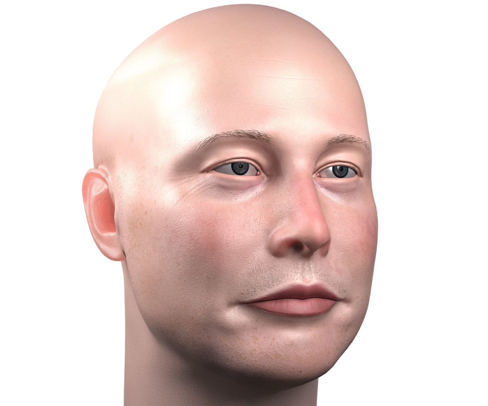

# ElonMuskBadTakeBot-Reddit-Bot

 
 
1. **This is a bot is a parody Elon Musk with his ridiculous bad opinions that are subject to my personal values. This bot is NOT an endorsement to Elon Musk and is very subjective.**

2. These bots is capable of reposting top posts from r/elonmusk subreddit to a dedicated subreddit, commenting threads that mentions Elon Musk on a subreddit without replying to the bot itself, and upvoting or downvoting a comment or post based on the attitude of the post or comment towards Elon Musk.
 
The bots are seperate to three files by functions: `bot_submission.py` is responsible for the reposting of r/elonmusk top posts to the dedicated subbreddit, `bot_upvote_downvote.py` is responsible for the upvote/downvote by the bots based on the sentiment of the comment/post towards the dedicated keywords/candidate (Elon Musk), and `bot.py` completes the rest (replying to all other comments that mention of Elon Musk with a fixated Matlib)
 
 ###**Side Note: I am currently working on the implementation of [Markovify](https://github.com/jsvine/markovify) to utilze basic machine learning so that the bot can reply to comments/posts based on the tones of speech of Elon Musk and the context of the comment/post.**

